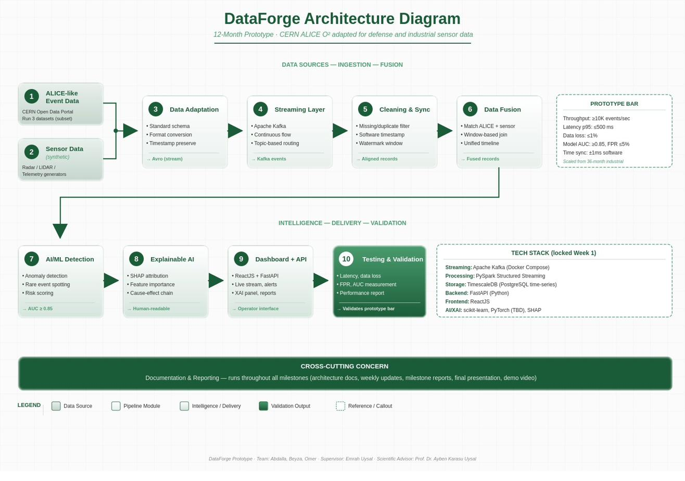

# DataForge 🔬

**Real-Time Scientific and Sensor Data Processing Platform**


[](https://github.com/Jeylani-2526/dataforge/actions/workflows/ci.yml)
[](LICENSE)
[](docs/milestones/)

---

## Table of Contents

- [What is DataForge?](#what-is-dataforge)
- [Why ALICE O²?](#why-alice-o)
- [Architecture](#architecture)
- [System Modules](#system-modules)
- [Tech Stack](#tech-stack)
- [Getting Started](#getting-started)
- [Project Structure](#project-structure)
- [Team](#team)
- [Roadmap](#roadmap)
- [Prototype Performance Bar](#prototype-performance-bar)
- [Contributing](#contributing)
- [License](#license)

---

## What is DataForge?

DataForge ingests high-volume scientific event data (CERN ALICE Run 1) and synthetic sensor streams (radar, LIDAR, telemetry), processes them in real time through a unified pipeline, detects anomalies with an AI/ML model, explains those decisions using SHAP-based Explainable AI, and delivers results to a live operator dashboard.

The system is a **TRL 4–5 prototype** — designed to prove the correctness of the pipeline and AI logic on laptop hardware via Docker Compose. It is not a production deployment.

**Pipeline summary:**
```
ALICE Data + Synthetic Sensor Data
  → Data Adaptation (Avro/Parquet)
  → Kafka Streaming
  → Spark Cleaning & Synchronization
  → Data Fusion (unified timeline)
  → AI/ML Anomaly Detection
  → Explainable AI (SHAP)
  → Dashboard + FastAPI
```

---

## Why ALICE O²?

ALICE O² (Online–Offline) is purpose-built for high-volume, event-based, real-time data processing — handling millions of particle collisions per second in parallel with fault tolerance. Radar, LIDAR, and telemetry sensors produce the same type of continuous, time-sensitive, event-like data. DataForge adapts this proven scientific architecture to industrial and defense sensor systems.

---

## Architecture



Full architecture documentation is in [`docs/architecture/`](docs/architecture/).

---

## System Modules

| # | Type | Module | Tech |
|---|------|---------|------|
| 1 | Source | ALICE-like Event Data | CERN Open Data Portal (Run 1) |
| 2 | Source | Sensor Data (synthetic) | Python generators (radar / LIDAR / telemetry) |
| 3 | Pipeline | Data Adaptation Layer | Avro, Parquet, Schema Registry |
| 4 | Pipeline | Streaming Layer | Apache Kafka (Docker Compose) |
| 5 | Pipeline | Cleaning & Synchronization | PySpark Structured Streaming, watermarks |
| 6 | Pipeline | Data Fusion | PySpark window-based join |
| 7 | Intelligence | AI/ML Anomaly Detection | scikit-learn / PyTorch (TBD), AUC ≥ 0.85 |
| 8 | Intelligence | Explainable AI (XAI) | SHAP |
| 9 | Delivery | Dashboard + API | ReactJS + FastAPI |
| 10 | Validation | Testing & Validation | pytest, Locust, custom perf harness |

---

## Tech Stack

| Layer | Technology |
|-------|-----------|
| Streaming | Apache Kafka 3.7 — Confluent image (Docker Compose) |
| Processing | PySpark 3.5 Structured Streaming |
| Storage | TimescaleDB ≥2.9 (PostgreSQL time-series) |
| Backend | FastAPI (Python) |
| Frontend | ReactJS |
| AI/XAI | scikit-learn · PyTorch (TBD) · SHAP |
| Serialization | Apache Avro · Parquet |
| Infrastructure | Docker Compose (Docker Desktop 4.x+) |

---

## Getting Started

### Prerequisites

- Docker Desktop ≥ 4.x installed and running
- Git
- Python 3.11+
- Node.js 20+

### 1. Clone the repo

```bash
git clone https://github.com/Jeylani-2526/dataforge.git
cd dataforge
```

### 2. Copy environment config

```bash
cp .env.example .env
# Edit .env with your local settings if needed
```

### 3. Start the full stack

```bash
docker compose up --build
```

Services will be available at:

| Service | URL |
|---------|-----|
| Dashboard (React) | http://localhost:3000 |
| API (FastAPI) | http://localhost:8000 |
| API Docs (Swagger) | http://localhost:8000/docs |
| Kafka UI | http://localhost:8080 |
| TimescaleDB | localhost:5432 |

### 4. Run tests

```bash
# Python services
cd services/
pip install -r requirements-dev.txt
pytest

# Frontend
cd services/dashboard/frontend
npm install && npm test
```

---

## Project Structure

```
dataforge/
├── .github/
│   ├── workflows/          # CI/CD — ci.yml
│   └── ISSUE_TEMPLATE/     # Bug report, feature request, milestone task
|   └── pull_request_template.md
|   data/
│   ├── samples/            # Small ALICE sample + synthetic data examples
│   └── schemas/            
|   └── cern_exploration_notes_beyza (1).md
├── docs/
|   ├── Infrastructure/
|   ├── api/                # API contracts and requirements
│   ├── architecture/       # Architecture diagram + description
|   ├── data/
|   ├── database/           # Database schema sketches
|   ├── learning/
|   ├── milestone2
│   ├── milestones/         # M1–M10 milestone documents
│   ├── requirements/       # FR/NFR docs, prototype performance bar (M1)
|   ├── research/          # Research notes — TimescaleDB, CERN data
│   ├── schemas/           # Avro schema specs (M2 deliverable)
│   │   ├── test_records/
|   └── Dataforge Testing Strategy.md
│   └── glossary.md         # Project-wide glossary (28 terms)
├── infrastructure/
|   ├── docker/            # Dockerfiles per service
|   ├── scripts/           # Setup, seed, and utility scripts
├── schemas/
│   ├── test_records/
├── services/
│   ├── adaptation-layer/                 # Module 3: Avro/Parquet conversion
│   ├── ai-ml/
│   │   ├── anomaly-detection/models/     # Module 7: ML model training & inference
│   │   ├── xai                           # Module 8: SHAP explainability
│   ├── dashboard/
│   │   ├── backend/                      # Module 9b: FastAPI backend
│   │   ├── frontend/                     # Module 9a: ReactJS dashboard
│   │   ├── specs/                        # Dashboard field specs and UI states
│   │   ├── wireframes/                   # wireframe images for all 7 pages
│   ├── data-sources/
│   │   ├── alice-ingestion/     # Module 1: CERN Open Data ingestion
│   │   └── sensor-generators/  # Module 2: Radar / LIDAR / telemetry generators
│   ├── fusion/                 # Module 6: Data fusion engine        
│   ├── streaming/
│   │   ├── kafka/               # Module 4: Kafka config & topics
│   │   └── spark/               # Module 5: PySpark cleaning & sync
│   ├── testing/                 # Module 10: Performance & validation
├── .env.example # Environment variable template         
├── .gitignore            
├── CONTRIBUTING.md  # Branching strategy, commit conventions
├── LICENSE
└── README.md
└── docker-compose.yml # Full stack orchestration
```

---

## Team

| Member | Role | Key Areas |
|--------|------|-----------|
| **Abdalla** | Project Lead | Architecture, AI/ML, XAI, documentation, team coordination |
| **Beyza** | Full-Stack Developer | Dashboard (ReactJS), FastAPI backend, TimescaleDB, UI/UX |
| **Omer** | Data Engineer | Kafka/Spark streaming, Docker, data simulation, performance testing |

**Supervisor:** Emrah Uysal — Dataseed Yazılım Elektronik (weekly written update every Friday)  
**Scientific Advisor:** Prof. Dr. Ayben Karasu Uysal — Yıldız Teknik Üniversitesi

---

## Roadmap

| # | Milestone | Dates | Status |
|---|-----------|-------|--------|
| M1 | Project Understanding & Requirements | 11 May – 7 Jun 2026 | ✅ Completed |
| M2 | Data Schema & Model Design | 8 Jun – 5 Jul 2026 | ✅ Completed |
| M3 | Data Generation & Preprocessing | 6 Jul – 2 Aug 2026 | ✅ Completed |
| M4 | Data Adaptation Layer | 3 Aug – 30 Aug 2026 | 🔄 In Progress |
| M5 | Streaming Pipeline | 31 Aug – 27 Sep 2026 | ⏳ Upcoming |
| M6 | Data Fusion & Synchronization | 28 Sep – 25 Oct 2026 | ⏳ Upcoming |
| M7 | AI/ML Anomaly Detection | 26 Oct – 22 Nov 2026 | ⏳ Upcoming |
| M8 | Explainable AI Layer | 23 Nov – 20 Dec 2026 | ⏳ Upcoming |
| M9 | Dashboard, API & Integration | 21 Dec 2026 – 14 Feb 2027 | ⏳ Upcoming |
| M10 | Testing & Final Delivery | 15 Feb – 9 Apr 2027 | ⏳ Upcoming |

See the full [Roadmap document](docs/milestones/DataForge_Roadmap.md) for week-by-week breakdowns.

**M4 status note:** Core M4 deliverables (data adaptation layer, schema-versioning enforcement, format conversion, staging-to-production promotion, TimescaleDB port-config fixes) are complete and committed. M4 remains **In Progress** rather than Completed because the pipeline throughput bar (≥10,000 events/sec) is not met — current measured throughput is 1,135.05 events/sec, root-caused but not resolved. See [`m4_package_cover_note.md`](docs/milestones/milestone4/m4_package_cover_note.md) and [`open_items_m4.md`](docs/milestones/milestone4/open_items_m4.md) for full detail.

---

## Prototype Performance Bar

These targets are agreed with Emrah Uysal and appropriate for laptop-Docker hardware. They are **not** the industrial targets from the full 36-month proposal.

| Metric | Target |
|--------|--------|
| Throughput | ≥ 10,000 events/sec |
| Latency (p95) | ≤ 500 ms |
| Data Loss | ≤ 1% |
| Model AUC | ≥ 0.85 |
| False Positive Rate | ≤ 5% |
| Time Sync (software) | ± 1 ms |

---

## Contributing

See [CONTRIBUTING.md](CONTRIBUTING.md) for the full branching strategy, commit message conventions, and PR process.

**Quick summary:**
- Branch from `develop`, never commit directly to `main`
- Both `main` and `develop` are branch-protected — PRs are required for both
- Branch naming: `feature/short-description` or `milestone/m2-schema-design`
- Commit format: `type(scope): message` — e.g. `feat(kafka): add topic config for sensor stream`
- All PRs require at least one review before merging to `develop`

---

## License

MIT License — see [LICENSE](LICENSE).

---

